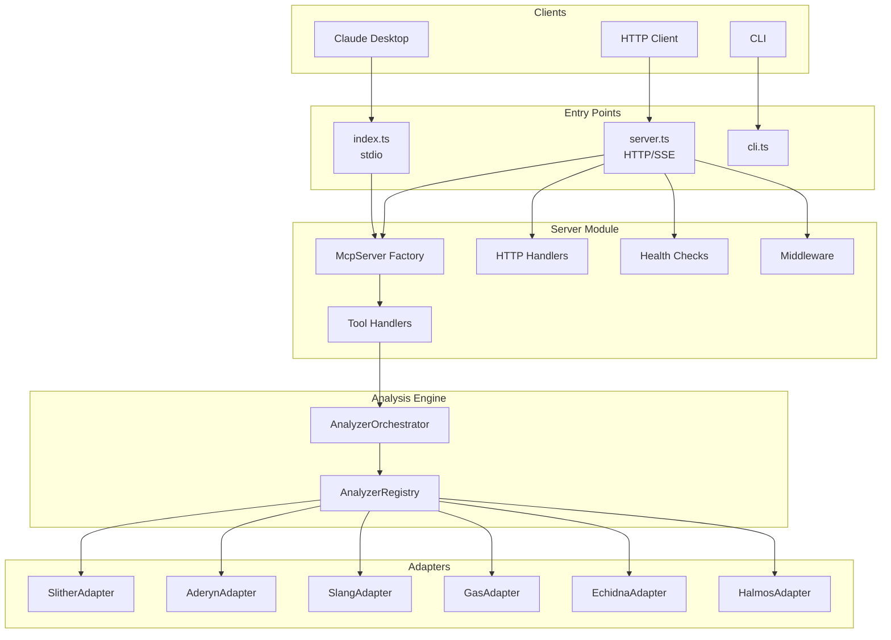
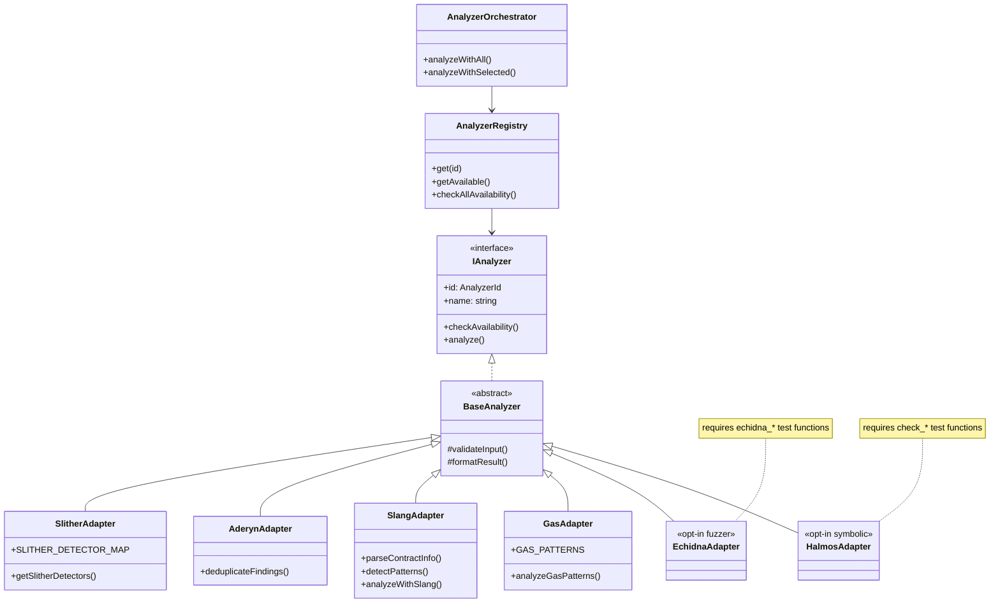
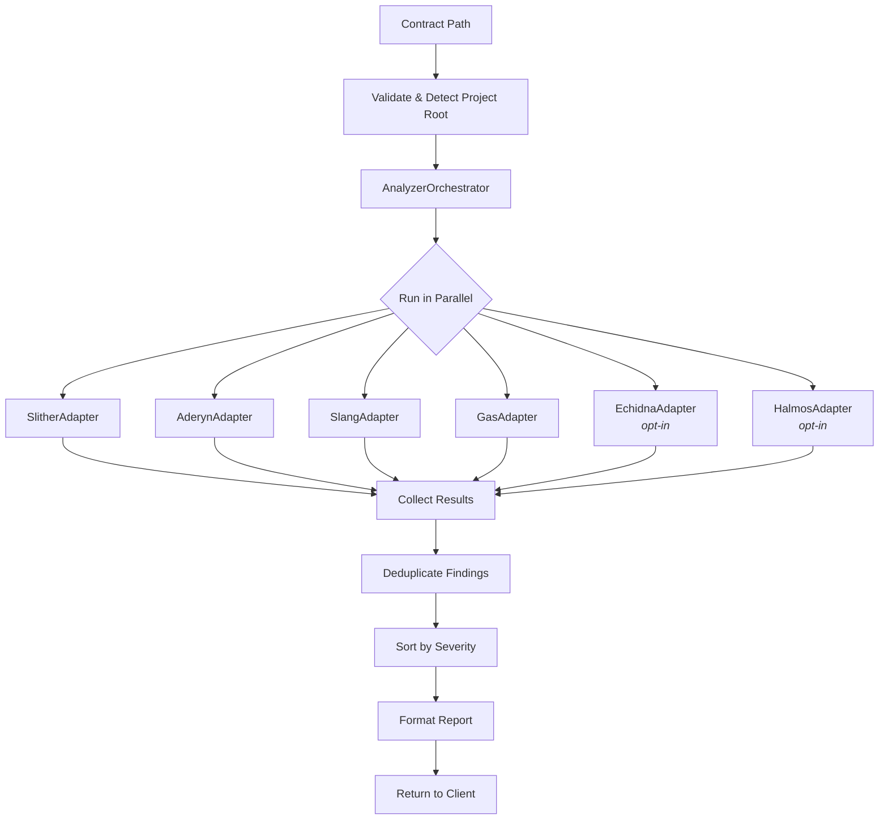

# Solidity Audit MCP - Architecture Guide

A comprehensive guide to understand how the Solidity Audit MCP works.

---

## What is MCP?

**MCP (Model Context Protocol)** is a standard that allows AI assistants (like Claude) to use external tools.

```
┌─────────────────┐                    ┌─────────────────┐
│                 │   "Audit this     │                 │
│  Claude / AI    │   contract"       │   MCP Server    │
│   Assistant     │ ───────────────▶  │  (This project) │
│                 │                    │                 │
│                 │ ◀─────────────────│                 │
│                 │   Security Report │                 │
└─────────────────┘                    └─────────────────┘
```

---

## High-Level Architecture



---

## Two Ways to Connect

### Local (stdio)

```json
{
  "mcpServers": {
    "audit": {
      "command": "npx",
      "args": ["solidity-audit-mcp"]
    }
  }
}
```

### Remote (SSE)

```json
{
  "mcpServers": {
    "audit": {
      "transport": {
        "type": "sse",
        "url": "http://localhost:3000/sse",
        "headers": { "X-API-Key": "your-key" }
      }
    }
  }
}
```

---

## Server Module Structure

The server logic is decoupled into reusable modules:

```
src/server/
├── index.ts              # Public API exports
├── config.ts             # Configuration (name, version, env)
├── McpServer.ts          # MCP server factory
│
├── schemas/
│   └── inputSchemas.ts   # Zod validation schemas
│
├── tools/
│   └── toolDefinitions.ts # MCP tool metadata
│
├── handlers/
│   ├── toolHandlers.ts   # Tool execution logic
│   └── httpHandlers.ts   # REST API handlers
│
├── health/
│   └── healthCheck.ts    # Analyzer availability checks
│
└── middleware/
    ├── auth.ts           # API key authentication
    └── cors.ts           # CORS configuration
```

---

## Analyzer Architecture

Uses **Adapter Pattern** for unified analyzer interface. Each adapter is **self-contained** — it owns its full implementation (runner, parser, deduplication) and re-exports all public symbols.



> **Note:** The legacy files `slither.ts`, `aderyn.ts`, `slangAnalyzer.ts`, and `gasOptimizer.ts` were merged into their respective adapters and deleted.

---

## Audit Pipeline



---

## Available Tools (10 total)

| Tool | Description |
|------|-------------|
| `analyze_contract` | Full security audit with all analyzers |
| `audit_project` | Scan entire project directory |
| `check_vulnerabilities` | SWC Registry scan (86 detectors) |
| `get_contract_info` | Contract metadata & attack surface |
| `run_tests` | Run Foundry tests with coverage |
| `optimize_gas` | Gas optimization suggestions |
| `diff_audit` | Compare contract versions |
| `generate_report` | Format findings into report |
| `generate_invariants` | Generate Foundry invariant test templates (auto-detects protocol type) |
| `explain_finding` | Detailed KB explanation for 19 finding IDs + keyword search |

---

## REST API Endpoints

| Endpoint | Method | Description |
|----------|--------|-------------|
| `/health` | GET | Full health with analyzer status |
| `/health/quick` | GET | Quick health check |
| `/info` | GET | Server info and tools |
| `/api/analyze` | POST | Analyze contract from source |
| `/api/check` | POST | Quick vulnerability check |
| `/api/ci/review` | POST | CI: Analyze & post PR comments |
| `/sse` | GET | SSE connection for MCP |
| `/message` | POST | MCP message handler |

---

## Severity Levels

| Level | Icon | Meaning |
|-------|------|---------|
| Critical | :rotating_light: | Direct fund loss |
| High | :red_circle: | Significant risk |
| Medium | :orange_circle: | Conditional risk |
| Low | :yellow_circle: | Best practices |
| Info | :blue_circle: | Suggestions |

---

## Templates

Markdown templates for reports and PR integration:

| Template | Usage |
|----------|-------|
| `reportTemplate.md` | Full audit report |
| `findingTemplate.md` | Individual finding |
| `prSummaryTemplate.md` | PR summary comment |
| `prLineCommentTemplate.md` | Inline code review |
| `diffAuditTemplate.md` | Version comparison |

---

## File Structure

```
solidity-audit-mcp/
├── src/
│   ├── index.ts           # MCP Server entry (stdio) - ~40 lines
│   ├── server.ts          # HTTP/SSE Server entry - ~280 lines
│   ├── cli.ts             # CLI tool
│   │
│   ├── server/            # Server module (modular architecture)
│   │   ├── config.ts
│   │   ├── McpServer.ts
│   │   ├── handlers/
│   │   ├── health/        # healthCheck.ts — 7 analyzers, cached status
│   │   ├── middleware/
│   │   ├── schemas/
│   │   └── tools/
│   │
│   ├── analyzers/         # Analyzer adapters (self-contained)
│   │   ├── IAnalyzer.ts
│   │   ├── AnalyzerRegistry.ts
│   │   ├── AnalyzerOrchestrator.ts
│   │   └── adapters/
│   │       ├── SlitherAdapter.ts   # Slither runner + detector map
│   │       ├── AderynAdapter.ts    # Aderyn runner + deduplication
│   │       ├── SlangAdapter.ts     # AST parsing (@nomicfoundation/slang)
│   │       ├── GasAdapter.ts       # Gas optimization patterns
│   │       ├── EchidnaAdapter.ts   # Property fuzzer (opt-in)
│   │       └── HalmosAdapter.ts    # Symbolic execution (opt-in)
│   │
│   ├── tools/             # MCP tool implementations (10 tools)
│   │   ├── analyzeContract.ts
│   │   ├── getContractInfo.ts
│   │   ├── checkVulnerabilities.ts
│   │   ├── runTests.ts
│   │   ├── generateReport.ts
│   │   ├── optimizeGas.ts
│   │   ├── diffAudit.ts
│   │   ├── auditProject.ts
│   │   ├── generateInvariants.ts   # Foundry invariant test generator
│   │   └── explainFinding.ts       # KB: 19 findings, 25+ keywords
│   │
│   ├── templates/         # Markdown report templates
│   ├── types/             # TypeScript type definitions
│   └── utils/             # Utility functions
│
├── __tests__/             # Test suite (486 tests)
└── docker/
    ├── Dockerfile.saas         # SaaS Docker (HTTP/SSE) — all tools included
    ├── Dockerfile.dev          # Development Docker
    ├── docker-compose.yml      # Local orchestration
    └── docker-compose.saas.yml # SaaS deployment
```

---

## Health Check (7 Analyzers)

The `/health` endpoint reports the availability of all analyzers:

| Analyzer | Type | Required | Notes |
|----------|------|----------|-------|
| `slither` | External binary (Python) | Core | 90+ detectors |
| `aderyn` | External binary (Rust) | Core | Fast AST-based |
| `forge` | External binary | Core | Test execution |
| `solc` | External binary | Core | Solidity compiler |
| `echidna` | External binary | Opt-in | x86_64 only |
| `halmos` | External binary | Opt-in | Requires z3-solver |
| `slang` | npm package (built-in) | Built-in | Always available |

**Status logic:**
- `healthy` — Slither + Forge both available
- `degraded` — Only one core tool, or only Slang
- `unhealthy` — No analyzers available (HTTP 503)

---

## Quick Reference

```
Client  ──▶  Entry Point  ──▶  Server Module  ──▶  Orchestrator  ──▶  Report
                                     │
                           ┌─────────┼─────────┐
                           ▼         ▼         ▼
                        Handler   Health   Middleware
                           │         │
                           │    (7 analyzers:
                           │     slither, aderyn,
                           │     forge, solc,
                           │     echidna, halmos,
                           │     slang)
                   ┌───────┼───────┬───────┬─────────┬────────┐
                   ▼       ▼       ▼       ▼         ▼        ▼
                Slither  Aderyn  Slang   Gas     Echidna  Halmos
                                              (opt-in) (opt-in)
```

---

## Design Patterns Used

| Pattern | Usage |
|---------|-------|
| **Adapter** | Unified interface for different analyzers |
| **Factory** | `createMcpServer()` creates configured servers |
| **Registry** | `AnalyzerRegistry` manages analyzer instances |
| **Strategy** | Swappable analyzer implementations |
| **Facade** | `AnalyzerOrchestrator` simplifies parallel execution |

---

*Solidity Audit MCP v1.6.0*
