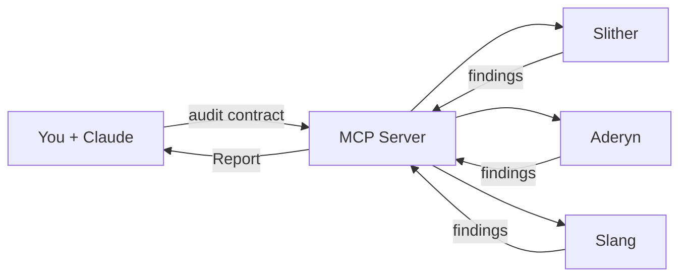
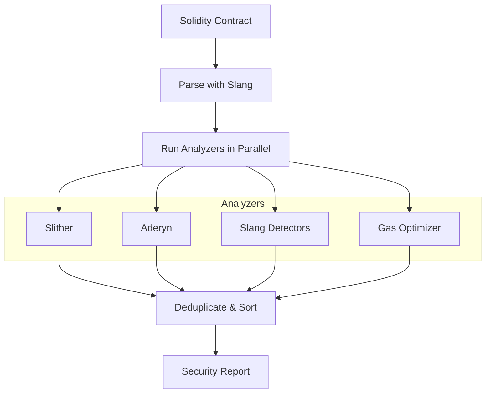

# Solidity Audit MCP - Architecture Guide

A simple guide to understand how the Solidity Audit MCP works.

---

## What is MCP?

**MCP (Model Context Protocol)** is a standard that allows AI assistants (like Claude) to use external tools.

```
┌─────────────────┐                    ┌─────────────────┐
│                 │   "Audit this     │                 │
│  Claude / AI    │   contract"       │   MCP Server    │
│   Assistant     │ ───────────────▶  │  (This project) │
│                 │                    │                 │
│                 │ ◀─────────────────│                 │
│                 │   Security Report │                 │
└─────────────────┘                    └─────────────────┘
```

---

## How It Works



---

## Two Ways to Connect

### Local (stdio)

```json
{
  "mcpServers": {
    "audit": {
      "command": "npx",
      "args": ["solidity-audit-mcp"]
    }
  }
}
```

### Remote (SSE)

```json
{
  "mcpServers": {
    "audit": {
      "transport": {
        "type": "sse",
        "url": "http://localhost:3000/sse",
        "headers": { "X-API-Key": "your-key" }
      }
    }
  }
}
```

---

## Audit Pipeline



---

## Available Tools

| Tool | Description |
|------|-------------|
| `analyze_contract` | Full security audit |
| `audit_project` | Scan entire project |
| `check_vulnerabilities` | Quick SWC scan |
| `get_contract_info` | Contract metadata |
| `run_tests` | Run Foundry tests |
| `optimize_gas` | Gas optimization |
| `diff_audit` | Compare versions |
| `generate_report` | Format report |

---

## Severity Levels

| Level | Meaning |
|-------|---------|
| 🔴 Critical | Direct fund loss |
| 🟠 High | Significant risk |
| 🟡 Medium | Conditional risk |
| 🟢 Low | Best practices |
| ⚪ Info | Suggestions |

---

## File Structure

```
solidity-audit-mcp/
├── src/
│   ├── index.ts        # MCP Server (stdio)
│   ├── server.ts       # HTTP/SSE Server
│   ├── cli.ts          # CLI tool
│   ├── analyzers/      # Slither, Aderyn, Slang
│   └── tools/          # MCP tool implementations
├── docker/             # Docker compose files
├── Dockerfile          # Local Docker
└── Dockerfile.saas     # SaaS Docker
```

---

## Quick Reference

```
You  ──▶  Claude  ──▶  MCP Server  ──▶  Report
                           │
                 ┌─────────┼─────────┐
                 ▼         ▼         ▼
              Slither   Aderyn    Slang
```

---

*Solidity Audit MCP v1.0.0*
