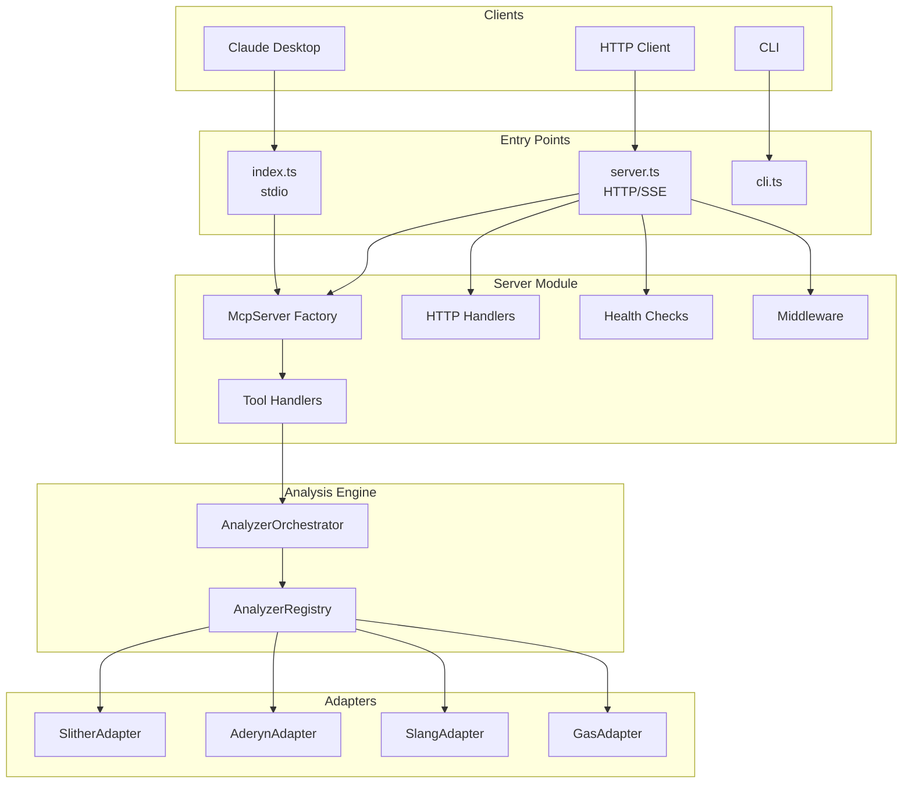
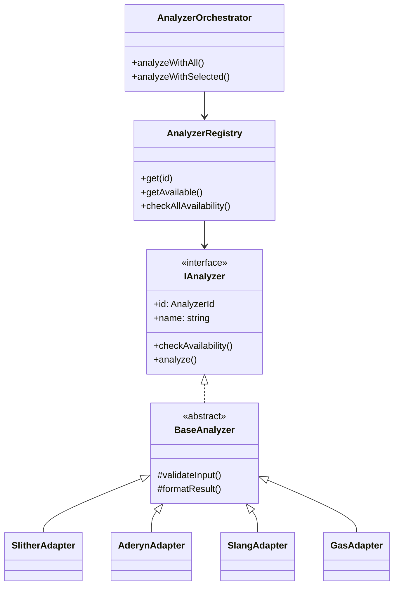
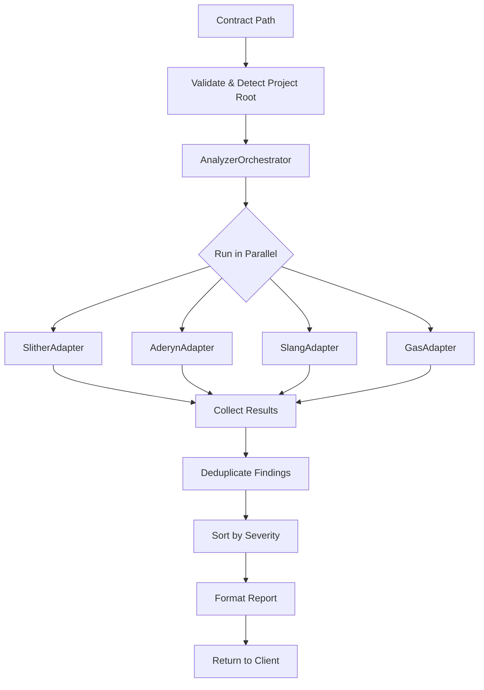

# Solidity Audit MCP - Architecture Guide

A comprehensive guide to understand how the Solidity Audit MCP works.

---

## What is MCP?

**MCP (Model Context Protocol)** is a standard that allows AI assistants (like Claude) to use external tools.

```
┌─────────────────┐                    ┌─────────────────┐
│                 │   "Audit this     │                 │
│  Claude / AI    │   contract"       │   MCP Server    │
│   Assistant     │ ───────────────▶  │  (This project) │
│                 │                    │                 │
│                 │ ◀─────────────────│                 │
│                 │   Security Report │                 │
└─────────────────┘                    └─────────────────┘
```

---

## High-Level Architecture



---

## Two Ways to Connect

### Local (stdio)

```json
{
  "mcpServers": {
    "audit": {
      "command": "npx",
      "args": ["solidity-audit-mcp"]
    }
  }
}
```

### Remote (SSE)

```json
{
  "mcpServers": {
    "audit": {
      "transport": {
        "type": "sse",
        "url": "http://localhost:3000/sse",
        "headers": { "X-API-Key": "your-key" }
      }
    }
  }
}
```

---

## Server Module Structure

The server logic is decoupled into reusable modules:

```
src/server/
├── index.ts              # Public API exports
├── config.ts             # Configuration (name, version, env)
├── McpServer.ts          # MCP server factory
│
├── schemas/
│   └── inputSchemas.ts   # Zod validation schemas
│
├── tools/
│   └── toolDefinitions.ts # MCP tool metadata
│
├── handlers/
│   ├── toolHandlers.ts   # Tool execution logic
│   └── httpHandlers.ts   # REST API handlers
│
├── health/
│   └── healthCheck.ts    # Analyzer availability checks
│
└── middleware/
    ├── auth.ts           # API key authentication
    └── cors.ts           # CORS configuration
```

---

## Analyzer Architecture

Uses **Adapter Pattern** for unified analyzer interface:



---

## Audit Pipeline



---

## Available Tools

| Tool | Description |
|------|-------------|
| `analyze_contract` | Full security audit with all analyzers |
| `audit_project` | Scan entire project directory |
| `check_vulnerabilities` | Quick SWC Registry scan |
| `get_contract_info` | Contract metadata & attack surface |
| `run_tests` | Run Foundry tests |
| `optimize_gas` | Gas optimization suggestions |
| `diff_audit` | Compare contract versions |
| `generate_report` | Format findings into report |

---

## REST API Endpoints

| Endpoint | Method | Description |
|----------|--------|-------------|
| `/health` | GET | Full health with analyzer status |
| `/health/quick` | GET | Quick health check |
| `/info` | GET | Server info and tools |
| `/api/analyze` | POST | Analyze contract from source |
| `/api/check` | POST | Quick vulnerability check |
| `/api/ci/review` | POST | CI: Analyze & post PR comments |
| `/sse` | GET | SSE connection for MCP |
| `/message` | POST | MCP message handler |

---

## Severity Levels

| Level | Icon | Meaning |
|-------|------|---------|
| Critical | :rotating_light: | Direct fund loss |
| High | :red_circle: | Significant risk |
| Medium | :orange_circle: | Conditional risk |
| Low | :yellow_circle: | Best practices |
| Info | :blue_circle: | Suggestions |

---

## Templates

Markdown templates for reports and PR integration:

| Template | Usage |
|----------|-------|
| `reportTemplate.md` | Full audit report |
| `findingTemplate.md` | Individual finding |
| `prSummaryTemplate.md` | PR summary comment |
| `prLineCommentTemplate.md` | Inline code review |
| `diffAuditTemplate.md` | Version comparison |

---

## File Structure

```
solidity-audit-mcp/
├── src/
│   ├── index.ts           # MCP Server entry (stdio) - ~40 lines
│   ├── server.ts          # HTTP/SSE Server entry - ~280 lines
│   ├── cli.ts             # CLI tool
│   │
│   ├── server/            # Server module (modular architecture)
│   │   ├── config.ts
│   │   ├── McpServer.ts
│   │   ├── handlers/
│   │   ├── health/
│   │   ├── middleware/
│   │   ├── schemas/
│   │   └── tools/
│   │
│   ├── analyzers/         # Analyzer adapters
│   │   ├── IAnalyzer.ts
│   │   ├── AnalyzerRegistry.ts
│   │   ├── AnalyzerOrchestrator.ts
│   │   └── adapters/
│   │
│   ├── tools/             # MCP tool implementations
│   ├── templates/         # Markdown report templates
│   ├── types/             # TypeScript type definitions
│   └── utils/             # Utility functions
│
├── __tests__/             # Test suite
├── docker/                # Docker compose files
├── Dockerfile             # Local Docker
└── Dockerfile.saas        # SaaS Docker
```

---

## Quick Reference

```
Client  ──▶  Entry Point  ──▶  Server Module  ──▶  Orchestrator  ──▶  Report
                                     │
                           ┌─────────┼─────────┐
                           ▼         ▼         ▼
                        Handler   Health   Middleware
                           │
                   ┌───────┼───────┬───────┐
                   ▼       ▼       ▼       ▼
                Slither  Aderyn  Slang   Gas
```

---

## Design Patterns Used

| Pattern | Usage |
|---------|-------|
| **Adapter** | Unified interface for different analyzers |
| **Factory** | `createMcpServer()` creates configured servers |
| **Registry** | `AnalyzerRegistry` manages analyzer instances |
| **Strategy** | Swappable analyzer implementations |
| **Facade** | `AnalyzerOrchestrator` simplifies parallel execution |

---

*Solidity Audit MCP v1.0.0*
